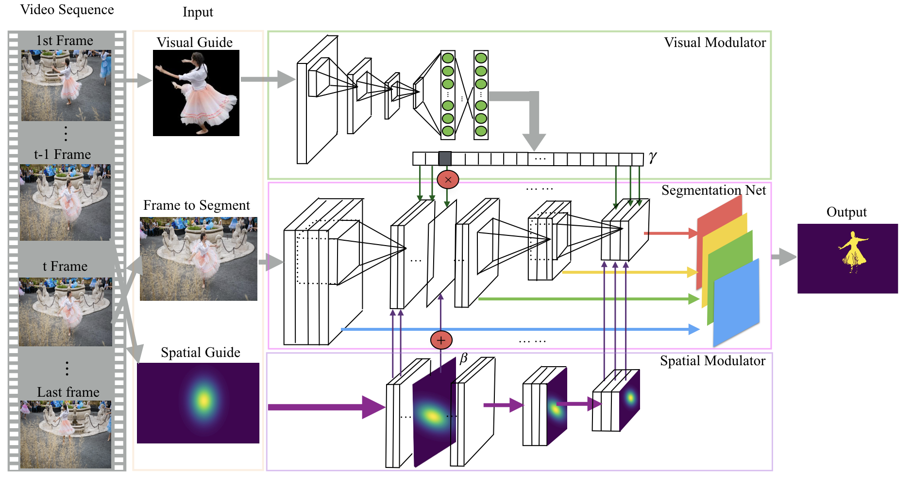

# OSMN: One-Shot Modulation Network for Semi-supervised Video Segmentation

This repo is the released code of one-shot modulation network described in the tech report:
```
@article{ Yang2018osmn,
  author = {Linjie Yang and Yanran Wang and Xuehan Xiong and Jianchao Yang and Aggelos K. Katsaggelos},  
title = {Efficient Video Object Segmentation via Network Modulation},
  journal = {arXiv preprint arXiv:1802.01218},
  year = {2018}
}
```
In this work, we propose to use a meta neural network named modulator to manipulate the intermediate layers of the segmentation network given the appearance of the object in the first frame. Our method only takes 140ms/frame for inference on DAVIS dataset.



## Installation
1. Clone the repository
   ```Shell
   git clone https://github.sc-corp.net/linjie-yang/video_segmentation.git
   ```
2. Install if necessary the required dependencies:
   
   - Python 2.7 
   - Tensorflow r1.0 or higher (`pip install tensorflow-gpu`) along with standard [dependencies](https://www.tensorflow.org/install/install_linux)
   - Densecrf by [Philipp Krähenbühl and Vladlen Koltun](https://github.com/lucasb-eyer/pydensecrf)
   - Other python dependencies: PIL (Pillow version), numpy, scipy
   

## Training

### Stage 1: Training the network on MS-COCO
1. Download MS-COCO 2017 dataset from [here](http://cocodataset.org/#download).
2. Download the VGG 16 model trained on Imagenet from the TF model zoo from [here](http://download.tensorflow.org/models/vgg_16_2016_08_28.tar.gz).
3. Place the vgg_16.ckpt file inside `models/`.
4. Run `python osmn_coco_pretrain.py --data_path DATA_PATH --model_save_path MODEL_SAVE_PATH --gpu_id GPU_ID --training_iters 200000` to train the model with a default learning rate 1e-5. After it finishes, run `python osmn_coco_pretrain.py --data_path DATA_PATH --model_save_path MODEL_SAVE_PATH --gpu_id GPU_ID --training_iters 300000 --learning_rate 1e-6` to further train it with a decreased learning rate. Be sure to keep `MODEL_SAVE_PATH` the same as in the first step to restore from existing checkpoint.
For reference to other arguments, please check them by running `python osmn_coco_pretrain.py -h`.

### Stage 2: Fine-tuning the network on DAVIS
1. Download DAVIS 2017 dataset from [here](http://davischallenge.org/code.html).
2. Preprocess the dataset by running `python preprocessing/preprocess_davis.py DATA_DIR`.
3. To finetune and evaluate the model on DAVIS 2017 as stated in the paper, run `python osmn_train_eval.py --data_path DATA_PATH --whole_model_path WHOLE_MODEL_PATH --result_path RESULT_PATH --model_save_path MODEL_SAVE_PATH_FT --gpu_id GPU_ID --batch_size 4 --fix_bn --randomize_guide --training_iters 50000 --learning_rate 1e-6`. Here `WHOLE_MODEL_PATH` should be the path to the model saved by Stage 1 training. Other arguments can be seen by running `python osmn_train_eval.py -h`. After it finishes, the prediction result on DAVIS 2017 will be saved into `RESULT_PATH`.

### One-shot finetuning on DAVIS
1. The trained model can be further improved by online one-shot finetuning on specific video sequences. Run the following command to finetune the model on either DAVIS 2016 or 2017.
```
python osmn_online_finetune.py --whole_model_path WHOLE_MODEL_PATH --result_path RESULT_PATH --model_save_path MODEL_SAVE_PATH_OL --gpu_id GPU_ID --batch_size 1 --training_iters 100 --data_version [2016/2017]
```

## Evaluation
1. To evaluate either Stage 1 or 2 model on DAVIS. Please run the following command.
```
python osmn_train_eval.py --data_path DATA_PATH --whole_model_path WHOLE_MODEL_PATH --result_path RESULT_PATH --only_testing --data_version [2016/2017] --gpu_id GPU_ID [--save_score] [--use_full_res]
```
`--save_score` need to be set while testing on DAVIS 2017, which is required to combined score maps of different objects for final prediction. `--use_full_res` is to use full resolution images for inference, which can be beneficial when visual guide is small.
Then run the following command to get the mIU score.
```
python davis_eval.py DATA_PATH RESULT_PATH DATASET_VERSION DATASET_SPLIT
```
2. To evaluate the model on [Youtube Objects](http://vision.cs.utexas.edu/projects/videoseg/). First download the dataset, then preprocess the dataset by running `python preprocessing/preprocess_youtube.py DATA_DIR`. Then evaluate the model.
```
python osmn_eval_youtube.py --data_path DATA_PATH --whole_model_path WHOLE_MODEL_PATH --result_path RESULT_PATH --gpu_id GPU_ID 
```
Then use the following command to get the mIU score.
```
python youtube_eval.py DATA_PATH RESULT_PATH
```
3. We release official model for both Stage 1 and 2, which can be downloaded from [here](https://www.dropbox.com/sh/6i5mgicuzmhart2/AACMO_C5guWcRHUD8K3ZHCV9a?dl=0). The Stage 1 model obtains mIU 72.2 on DAVIS 2016 and 52.5 on DAVIS 2017. The Stage 2 model obtains mIU 74.0 on DAVIS 2016.

## Contact ##
If you have any questions regarding the repo, please send email to Linjie Yang (linjie.yang@snap.com). 
